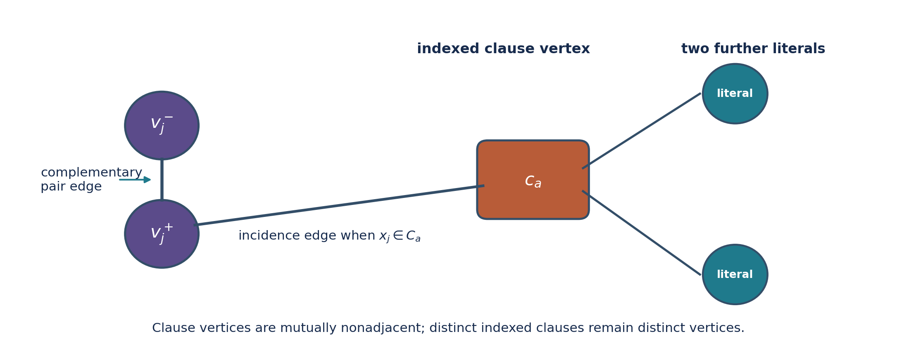

**Release status.** Unrefereed candidate `txgraffiti-c3-resolution/4.0.0-rc1`. All bundled theorem-critical deterministic checks passed in the recorded environment and from a clean extracted copy. The exact release has not been independently rerun, independently reimplemented, formally verified or conventionally peer reviewed. A predecessor received scoped independent analysis; a byte-distinct v3 predecessor received a full technical review. The same graph was publicly deposited on 23 July 2026, so this paper makes no discovery-priority claim [@publicrepo2026].

# Abstract

Caro, Davila and Pepper conjectured that every finite positive-degree regular graph satisfies

\[
i(G)\leq \mu^*(G),
\]

where \(i(G)\) is the minimum cardinality of a maximal independent set and \(\mu^*(G)\) is the minimum cardinality of a maximal matching [@caro2022]. We give a connected cubic graph \(G\) on 50 vertices with

\[
\boxed{\mu^*(G)=15<16=i(G)},
\]

which disproves the conjecture.

The graph comes from a 15-variable, 20-clause formula in which each positive and each negative literal occurs exactly twice. For the associated indexed clause-literal graph, we prove

\[
\boxed{i(G(F))=k+\beta(F)},
\]

where \(\beta(F)\) is the minimum bilateral deficiency of a partial assignment. This identity accounts for independent dominating sets that mix literal and clause vertices, which ordinary satisfiability does not control. Exhaustive enumeration gives \(\beta(F)=1\).

A second exact route uses a 21,803-byte gzip-compressed proof-tree certificate, checked from the raw graph by a separately written standard-library Python program, to exclude every independent dominating set of size at most 15. The matching value follows from an explicit maximal matching and a five-edges-per-matching-edge count. Finally, conditional on the published 20-clause lower bound for unsatisfiable \((3,2,2)\)-formulas, we prove that every cubic graph with a dominating induced matching and order below 50 satisfies the conjectured inequality. The example attains this boundary within that subclass; no unrestricted order-minimality claim is made.

# 1. Definitions, conjecture and claim map

All graphs are finite, simple and undirected. An **independent dominating set** is an independent vertex set whose closed neighbourhood is the whole vertex set. Equivalently, it is a maximal independent set. Its minimum cardinality is the **independent domination number** \(i(G)\).

A **minimum maximal matching** is a maximal matching of minimum cardinality. Its cardinality is denoted \(\mu^*(G)\), also written \(\gamma_e(G)\). A maximal matching is edge-dominating: every graph edge lies in the matching or shares an endpoint with a matching edge.

Caro, Davila and Pepper state the target as Conjecture 15 [@caro2022]. Davila, Brimkov and Pepper later restate it as TxGraffiti Conjecture 3 [@davila2025]:

> If \(G\) is \(r\)-regular with \(r>0\), then \(i(G)\leq\mu^*(G)\).

The principal claims and their proof burdens are:

| Claim | Evidence | Dependency class |
|---|---|---|
| Canonical graph is connected, cubic, order 50 | Raw graph in three encodings and deterministic cross-check | Bundled finite fact |
| \(\mu^*(G)=15\) | Explicit matching and elementary 75/5 lower bound | Hand-checkable |
| \(i(G)\leq16\) | Explicit 16-vertex witness | Hand-checkable |
| \(i(G)\geq16\) | Raw-graph proof tree; separately, Theorem 1 plus exhaustive partial assignments | Bundled exact certificates |
| Conjecture is false | Combination of the preceding invariant values | Self-contained relative to bundle |
| Order-50 boundary in the dominating-induced-matching subclass | Graph-to-formula transfer plus 20-clause SAT threshold | External theorem dependency |

The central disproof does not use the external 20-clause result.

# 2. Clause-literal graphs and an exact identity

## 2.1 Prior art and bounded novelty

SAT-to-independent-domination reductions predate this work. Zverovich's satgraph programme reports a linear-time relationship between satisfiability and independent domination for corresponding graphs [@zverovich2006]. Ahadi and Dehghan study the exact twice-positive/twice-negative occurrence class and domination reductions [@ahadi2019]. Zhang, Peitl and Szeider explicitly define a clause-literal graph with literal vertices, clause vertices, complementary-literal edges and incidence edges [@zhang2024].

The basic graph architecture and the exact-occurrence formula class are therefore not new. We prove the following exact optimisation identity; our targeted search did not locate an equivalent published statement. A complete full-text comparison of all satgraph results was not performed, so this is a bounded novelty statement rather than a priority claim.

| Feature | Present result | Closest inspected antecedent | Difference claimed here |
|---|---|---|---|
| Graph architecture | Complementary literal pair plus indexed clause vertices | Zhang et al.; related satgraphs in Zverovich | No novelty claimed |
| Signed occurrence class | Each sign occurs exactly twice | Ahadi-Dehghan; Zhang et al. | No novelty claimed |
| Objective | Exact minimum independent domination number | Satisfiability or hardness reductions | Additive optimum identity |
| Assignment object | Bilateral partial assignment | Complete SAT assignment in closest located statements | Mixed literal-clause sets represented exactly |

`PRIOR_ART_COMPARISON.md` gives the fuller definition-by-definition comparison.

## 2.2 Indexed clause semantics and graph construction

Let \(F=(C_a)_{a\in A}\) be an indexed family of clauses on variables \(x_1,\ldots,x_k\). Each clause is treated as a set of literals: repeated positions inside one clause collapse, but extensionally equal clauses may retain different indices and therefore different clause vertices. Tautological and empty clauses are allowed in Theorem 1.

Construct \(G(F)\) as follows, using the established clause-literal architecture [@zhang2024]:

1. For each variable \(x_j\), create vertices \(v_j^-\) and \(v_j^+\), representing \(\neg x_j\) and \(x_j\), and add the complementary-pair edge \(v_j^-v_j^+\).
2. For each indexed clause \(C_a\), create a clause vertex \(c_a\).
3. Join \(c_a\) to each literal vertex represented in \(C_a\). Add no other edges.

{width=95%}

For a partial assignment \(\alpha\in\{0,1,*\}^k\), let \(U(\alpha)\) be the variables left unassigned. Let \(T(\alpha)\) be the indexed clauses not already satisfied by an assigned literal. Call \(\alpha\) **bilateral** when, for every \(x_j\in U(\alpha)\), both \(x_j\) and \(\neg x_j\) occur among the clauses in \(T(\alpha)\). Define

\[
\beta(F)=\min_{\alpha\ \mathrm{bilateral}}
\left(|T(\alpha)|-|U(\alpha)|\right).
\]

Complete assignments are bilateral vacuously, so the minimum is defined, including when \(k=0\).

## Theorem 1. Exact independent-domination identity

For every indexed CNF \(F\) on \(k\) variables,

\[
\boxed{i(G(F))=k+\beta(F)}.
\]

### Proof

Take a bilateral partial assignment \(\alpha\). Select the literal vertex prescribed by every assigned variable and select every clause vertex indexed by \(T(\alpha)\). Call the resulting set \(D_\alpha\).

The selected literal vertices are independent because at most one endpoint of each complementary pair is selected and different pairs have no edges between them. A clause vertex in \(T(\alpha)\) has no selected literal neighbour, by definition of \(T(\alpha)\), and clause vertices are mutually nonadjacent. Hence \(D_\alpha\) is independent.

Every assigned literal pair is dominated by its selected endpoint. Every clause outside \(T(\alpha)\) has a selected satisfying literal neighbour, and every clause inside \(T(\alpha)\) is selected. For an unassigned variable, bilaterality places each sign in at least one selected clause, so both literal vertices are dominated. Thus \(D_\alpha\) is an independent dominating set with

\[
|D_\alpha|=(k-|U(\alpha)|)+|T(\alpha)|
=k+|T(\alpha)|-|U(\alpha)|.
\]

Therefore \(i(G(F))\leq k+\beta(F)\).

Conversely, let \(D\) be an independent dominating set. Independence permits at most one literal vertex from each pair. Assign a variable according to the selected endpoint and leave it unassigned when neither endpoint is selected, producing \(\alpha_D\).

A clause vertex \(c_a\) belongs to \(D\) exactly when no selected literal occurs in \(C_a\). If a selected literal occurs, independence excludes \(c_a\). If no selected literal occurs and \(c_a\notin D\), then \(c_a\) has no neighbour in \(D\), contradicting domination. Hence the selected clause vertices are exactly those indexed by \(T(\alpha_D)\).

If \(x_j\) is unassigned, neither endpoint of its complementary pair is selected. Each endpoint must therefore be dominated through a selected clause vertex, requiring a residual occurrence of each sign. Thus \(\alpha_D\) is bilateral, and

\[
|D|=(k-|U(\alpha_D)|)+|T(\alpha_D)|
\geq k+\beta(F).
\]

The two inequalities give equality. \(\square\)

The proof covers tautological clauses, empty clauses, absent variables, one-sided variables and \(k=0\), under the indexed literal-set semantics above.

## Why unsatisfiability alone is insufficient

A complete satisfying assignment would give \(|T|=|U|=0\) and an independent dominating set of size \(k\). An unsatisfiable formula rules out only those size-\(k\) sets that select one literal for every variable. A smaller or equal graph optimum might instead mix selected literal vertices with selected clause vertices and leave some variables unassigned. Bilaterality is the condition forced by domination of both endpoints of every unassigned pair. The deficiency \(|T|-|U|\) measures the exact cost of that mixing.

# 3. Exact twice-occurrence proper 3-CNFs

For this paper, a **proper indexed 3-CNF** means that every indexed clause is a set of exactly three distinct literals on three distinct variables and contains no complementary pair. Equal clauses may have distinct indices.

## Theorem 2

Suppose \(F\) is a proper indexed 3-CNF on \(k\) variables and every positive and every negative literal occurs in exactly two indexed clauses. Then \(G(F)\) is cubic and

\[
\boxed{\mu^*(G(F))=k,
\qquad
i(G(F))=k+\beta(F)}.
\]

### Proof

Every literal vertex has one complementary-pair edge and two incidence edges. Every clause vertex has three incidence edges to distinct literal vertices. Hence \(G(F)\) is cubic.

The \(k\) complementary-pair edges form a matching. Their unmatched vertices are exactly the mutually nonadjacent clause vertices, so the matching is maximal and \(\mu^*(G(F))\leq k\).

The formula contains \(4k\) literal occurrences. Therefore \(G(F)\) has \(k+4k=5k\) edges. A matching edge in a cubic graph can dominate at most itself and four adjacent edges. Every maximal matching is edge-dominating, so any maximal matching has at least \(5k/5=k\) edges. Thus \(\mu^*(G(F))=k\). The formula for \(i(G(F))\) is Theorem 1. \(\square\)

A formula in this class yields a counterexample exactly when \(\beta(F)>0\).

# 4. Conditional order threshold for cubic dominating induced matchings

A matching is a **dominating induced matching** when it is induced and every graph edge is either in the matching or adjacent to a matching edge. The following theorem uses one external computational extremal result: Zhang, Peitl and Szeider report that an unsatisfiable \((3,2,2)\)-formula requires at least 20 clauses [@zhang2024]. Their convention requires exactly three distinct literals per non-tautological clause and bounds positive and negative occurrences separately. `THEOREM_DEPENDENCY.md` pins the source metadata and gives the transfer in full.

## Lemma 3. Definition transfer

Let \(G\) be a finite simple cubic graph with a dominating induced matching \(M\). Orient each edge of \(M\) and introduce one variable per matching edge. For every unmatched vertex \(w\), form the clause consisting of the signed endpoints adjacent to \(w\).

After removing tautological clauses and extensionally duplicate clauses, the resulting formula is a \((3,2,2)\)-formula in the convention of Zhang, Peitl and Szeider.

### Proof

Every unmatched vertex has three distinct neighbours, all endpoints of matching edges. If it is adjacent to both endpoints of one matching edge, its clause contains complementary literals and is tautological; deleting it preserves satisfiability. Otherwise its three neighbours lie on three distinct matching edges, so the clause contains exactly three distinct literals on distinct variables and no complementary pair. Deleting duplicate clauses also preserves satisfiability. Each endpoint of a matching edge has one incident matching edge and exactly two remaining incident edges, so each positive and each negative literal occurs at most twice. \(\square\)

## Theorem 3. Conditional restricted threshold

Assume the published result that every \((3,2,2)\)-formula with fewer than 20 clauses is satisfiable [@zhang2024]. If a cubic graph \(G\) has a dominating induced matching and \(|V(G)|<50\), then

\[
i(G)\leq\mu^*(G).
\]

### Proof

Let \(t=|M|\) and let \(W\) be the unmatched vertices. Every matching edge sends four edges to \(W\), while every vertex in \(W\) has degree three. Hence

\[
4t=3|W|,
\qquad
|V(G)|=2t+|W|,
\qquad
 t=\frac{3|V(G)|}{10},
\qquad
|W|=\frac{2|V(G)|}{5}.
\]

The reduced endpoint formula from Lemma 3 has at most \(|W|\) clauses. If \(|V(G)|<50\), then \(|W|<20\), so the formula is satisfiable by the external result. A satisfying assignment selects one endpoint of every edge in \(M\). Because \(M\) is induced, the selected endpoints are independent; they dominate all endpoints of \(M\) and, by clause satisfaction, every vertex in \(W\). Thus \(i(G)\leq t\).

A cubic graph has \(3|V(G)|/2=5t\) edges. Any matching edge dominates at most five edges, so every maximal matching has size at least \(t\). The given matching is maximal and has size \(t\), hence \(\mu^*(G)=t\). Therefore \(i(G)\leq\mu^*(G)\). \(\square\)

The counterexample below has order 50 and a dominating induced matching, so this order boundary is sharp **within the dominating-induced-matching subclass**. The theorem does not exclude a smaller cubic counterexample outside that subclass.

# 5. The formula and graph

Take the following 20 clauses on \(x_1,\ldots,x_{15}\):

\[
\begin{array}{ll}
C_1=(x_1\vee x_9\vee\neg x_{11}), &
C_2=(\neg x_4\vee\neg x_{10}\vee\neg x_{13}),\\
C_3=(x_1\vee\neg x_9\vee\neg x_{14}), &
C_4=(x_2\vee x_6\vee x_{14}),\\
C_5=(\neg x_5\vee\neg x_6\vee x_{15}), &
C_6=(x_2\vee\neg x_3\vee x_{15}),\\
C_7=(x_3\vee x_5\vee\neg x_9), &
C_8=(\neg x_6\vee\neg x_{12}\vee\neg x_{15}),\\
C_9=(\neg x_1\vee x_5\vee\neg x_{11}), &
C_{10}=(x_4\vee\neg x_7\vee\neg x_{15}),\\
C_{11}=(\neg x_2\vee x_8\vee\neg x_{12}), &
C_{12}=(x_3\vee x_9\vee x_{11}),\\
C_{13}=(\neg x_4\vee\neg x_8\vee x_{10}), &
C_{14}=(x_7\vee\neg x_8\vee x_{13}),\\
C_{15}=(x_4\vee x_7\vee\neg x_{13}), &
C_{16}=(\neg x_2\vee\neg x_7\vee x_{14}),\\
C_{17}=(\neg x_3\vee x_{11}\vee\neg x_{14}), &
C_{18}=(x_8\vee x_{10}\vee x_{12}),\\
C_{19}=(\neg x_{10}\vee x_{12}\vee x_{13}), &
C_{20}=(\neg x_1\vee\neg x_5\vee x_6).
\end{array}
\]

Every signed literal occurs exactly twice. Let \(G=G(F)\), with labels

\[
v_j^-=2(j-1),
\qquad
v_j^+=2(j-1)+1,
\qquad
c_a=29+a.
\]

The graph has 30 literal vertices, 20 clause vertices, 15 complementary-pair edges and 60 incidence edges. Hence it has 50 vertices and 75 edges, and every vertex has degree three. Deterministic parsers confirm simplicity, one connected component and girth five. The graph is encoded in `counterexample.json`, `counterexample.edgelist` and `counterexample.g6`.

# 6. Exact invariant values

## Proposition 4. \(\mu^*(G)=15\)

The 15 complementary-pair edges form a matching. Their unmatched vertices are precisely the mutually nonadjacent clause vertices, so the matching is maximal and \(\mu^*(G)\leq15\).

A maximal matching is edge-dominating. In a cubic graph, one matched edge can dominate at most itself and four other incident edges. Since \(G\) has 75 edges, every maximal matching has at least

\[
\left\lceil\frac{75}{5}\right\rceil=15
\]

edges. Thus

\[
\boxed{\mu^*(G)=15}.
\]

## Proposition 5. \(i(G)=16\)

### Upper bound

The complete assignment

\[
x_1=0,
\qquad
x_2=x_3=1,
\qquad
x_4=\cdots=x_{15}=0
\]

satisfies every clause except \(C_{18}\). Select the 15 prescribed literal vertices and the clause vertex \(c_{18}\). In numeric labels this is

\[
D_0=\{0,3,5,6,8,10,12,14,16,18,20,22,24,26,28,47\}.
\]

Direct inspection or `check_encodings.py` confirms that \(D_0\) is independent and dominating. Hence \(i(G)\leq16\).

### Lower bound route A: raw-graph proof tree

The certificate `ids_le15.tree.gz` proves that no independent dominating set has size at most 15. It contains 256,714 nodes and is 21,803 bytes in gzip-compressed form.

At a proof-tree node, let \(S\) be the selected independent set and \(D=N[S]\). Every vertex outside \(D\) is nonadjacent to all of \(S\) and is therefore addable. For an undominated vertex \(w\), every independent dominating extension must select a vertex in \(N[w]\setminus D\). The certificate branches over all such candidates. A leaf closes only when the cubic coverage bound

\[
|S|+\left\lceil\frac{|V(G)\setminus D|}{4}\right\rceil>15
\]

holds: one additional selected vertex can newly dominate at most itself and its three neighbours.

The standard-library Python checker reconstructs \(S\), \(D\), every branch set and every bound from the raw graph. It does not trust state masks, cardinalities or pruning claims from the C++ generator. Deterministic regeneration produces a byte-identical compressed certificate. Four targeted corruptions - invalid bound leaf, invalid branch witness, truncation and trailing data - are rejected. These mutations test named failure modes; they are not a formal verification of the checker.

This route proves \(i(G)>15\) without using the formula identity.

### Lower bound route B: bilateral deficiency

The dependency-free C++ verifier enumerates all

\[
3^{15}=14{,}348{,}907
\]

partial assignments. Exactly 939,975 are bilateral, and every one satisfies

\[
|T(\alpha)|-|U(\alpha)|\geq1.
\]

Equality occurs, so \(\beta(F)=1\). Theorem 1 gives

\[
i(G)=15+\beta(F)=16.
\]

The raw-graph tree and bilateral enumeration use different state spaces and different implementations. Either exact lower-bound route, combined with the explicit witness, proves Proposition 5. Optional generic mixed-integer models return \(i(G)=16\) and \(\mu^*(G)=15\) with zero reported gap, but those models are corroborative rather than load-bearing.

## Counterexample theorem

Propositions 4 and 5 give

\[
\boxed{\mu^*(G)=15<16=i(G)}.
\]

The TxGraffiti conjecture is false.

# 7. Additional formula facts

A complete truth-table check over all \(2^{15}=32{,}768\) assignments finds:

- no satisfying assignment;
- minimum unsatisfied-clause count one;
- exactly 3,318 assignments attaining that minimum;
- satisfiability after deletion of each one of the 20 clauses;
- the displayed assignment falsifying only \(C_{18}\).

Thus the indexed formula is minimally unsatisfiable as represented. These facts explain the transparent \(15+1\) witness. They do not prove \(i(G)\geq16\) without the bilateral identity or raw-graph certificate.

# 8. Assurance, provenance and limitations

The exact release assurance state is recorded in `ASSURANCE.json`:

| Dimension | State for exact v4 |
|---|---|
| Bundled deterministic core replay | Passed in recorded environment and clean extracted copy |
| Exact-release independent rerun | No |
| Exact-release independent reimplementation | No |
| Formal proof-assistant verification | No |
| Conventional peer review | No |
| Pinned environment definition | Yes; container execution pending |
| Predecessor independent analysis | Partial and hash-scoped |

The same labelled graph was public before this paper [@publicrepo2026]. This release therefore consolidates and audits the evidence; it does not claim first disclosure. The clause-literal architecture and twice-positive/twice-negative formula class are prior art. The exact identity carries only the statement that a targeted search did not locate an equivalent published theorem.

The work does not determine the smallest unrestricted cubic or regular counterexample, uniqueness at order 50, or an infinite family. The order-50 result is sharp only within the dominating-induced-matching subclass and is conditional on the external 20-clause theorem. The central counterexample remains independent of that external dependency.

# 9. Research directions

1. Search for smaller cubic counterexamples outside the dominating-induced-matching subclass.
2. Determine whether bilateral deficiency yields infinite regular counterexample families or structural bounds.
3. Reduce or formally verify the raw-graph certificate and checker.
4. Complete the theorem-by-theorem satgraph novelty comparison.
5. Obtain an exact-release clean-room reproduction and specialist review.

# References
